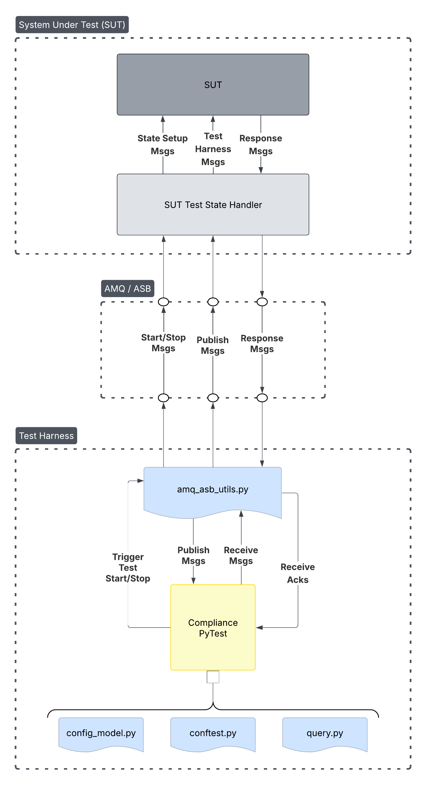
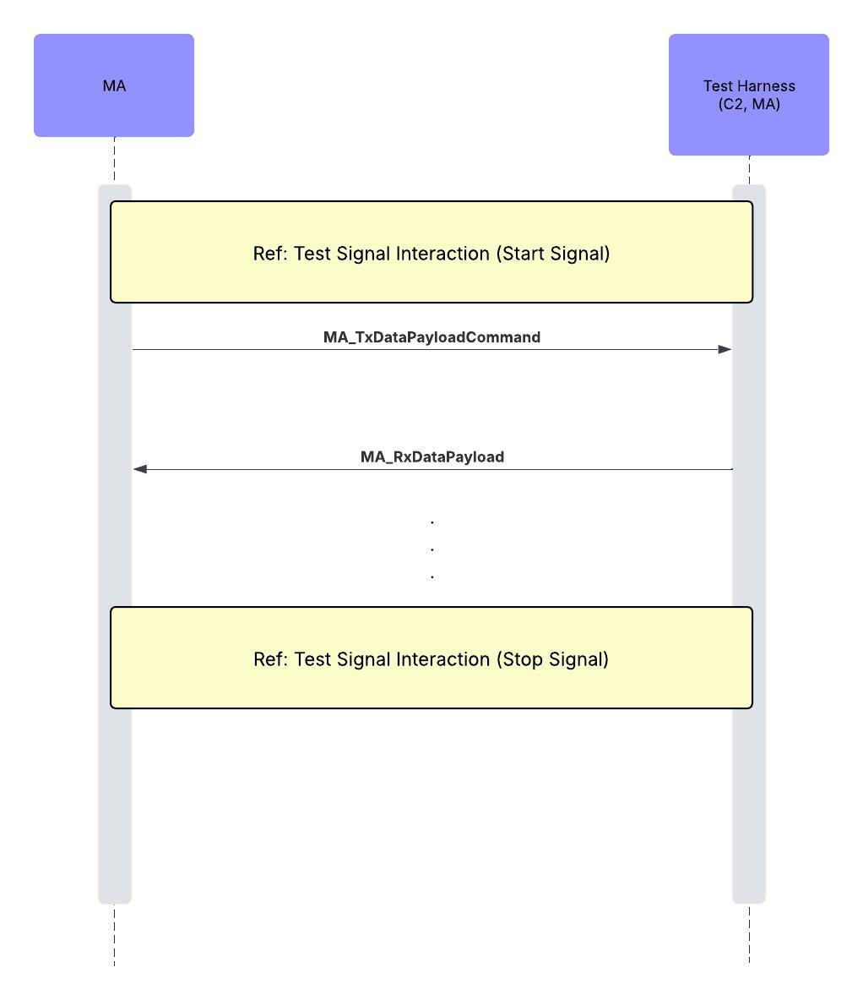
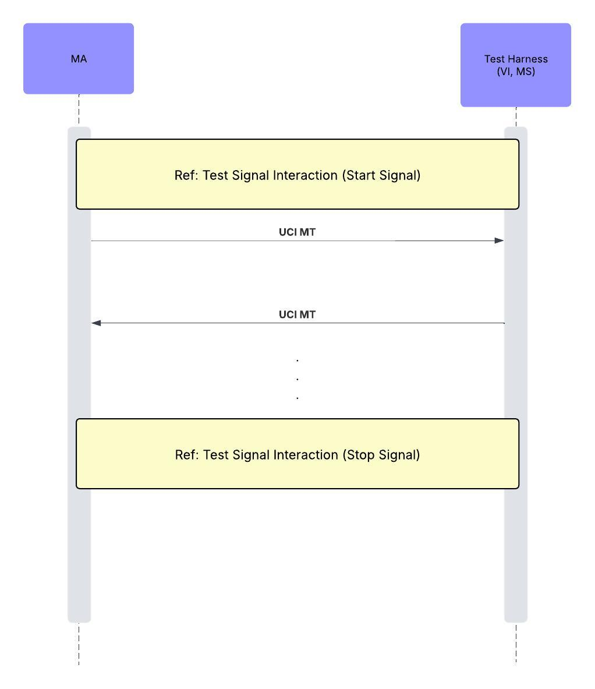
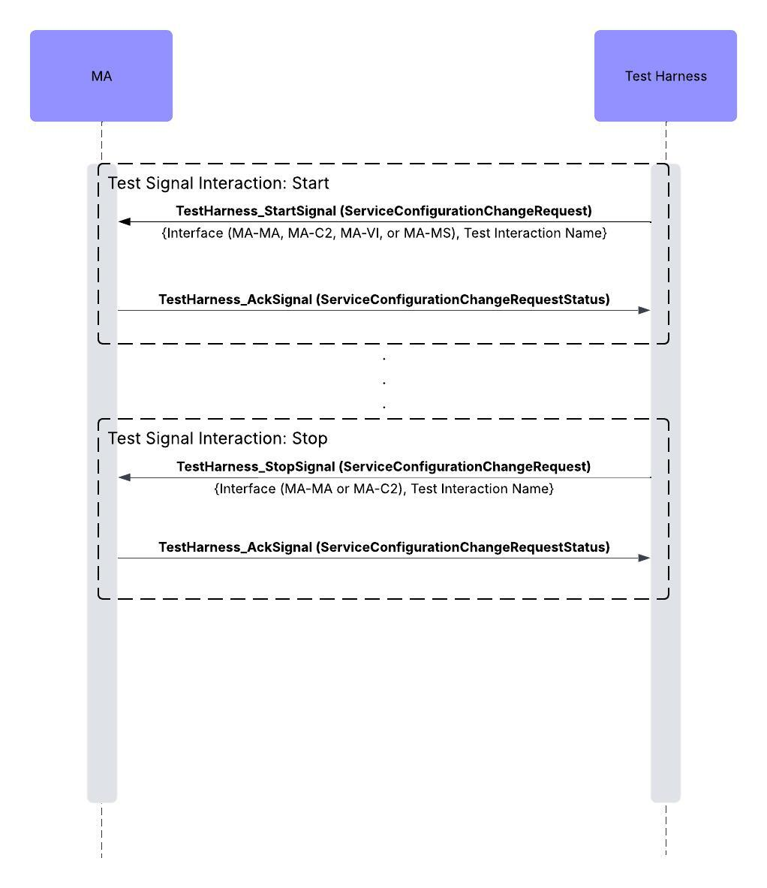

# Compliance Test Harness

**Test Harness standalone ZIP:** [Download](https://github.com/open-arsenal/a-gra-test-harness/releases/download/v5.0/test-harness-AGRA_5.0a_v1.2.2.zip)

A test harness for validating A-GRA messaging compliance against a System Under Test (SUT).
This test harness is comprised of 3 main components, described in more detail [below](#details):

- Python scripts that drive all testing
- Test harness container image that facilitates executing the Python scripts
- ActiveMQ (AMQ) container image utilized for ASB communication

The following workflows are supported for running the tests:

- **[Container workflow](#container-workflow)** _(recommended)_ — run everything inside pre-built
  containers with no local Python environment required.

## Prerequisites

### Container Workflow

- Bash shell
- Podman with `podman-compose`, **or** Docker with the `docker compose` plugin
  - Podman is the default; Docker is used as a fallback if Podman is not available
  - Pass `--podman` or `--docker` to any script to override auto-detection

### SUT Requirements

The SUT must be able to handle the setting and tearing down of state data required for each test
run. See [Design](#design) for details on how the test harness coordinates with the SUT.

## Design

The general design of this test harness framework is to utilize PyTests to initiate the testing
and drive the SUT communication, while validating the expected messages are received for each
interaction defined in the A-GRA.

<div style="text-align: center;">
  
  <p><em>Figure 1: Test Harness Architecture. </em></p>
</div>

The tests reside in the [compliance_test_harness](./compliance_test_harness/) folder, and are
broken down into subfolder categories to resemble the SUT subsystem to test against:

- `C2`: Test Harness acts as MA communicating with C2 to test C2 interface
- `MS`: Test Harness acts as MA communicating with MS to test MS interface
- `VI`: Test Harness acts as MA communicating with VI to test VI interface
- `MA`:
  - `C2`: Test Harness acts as C2 communicating with MA to test MA-C2 interface
  - `VI`: Test Harness acts as VI communicating with MA to test MA-VI interface
  - `MA`: Test Harness acts as MA communicating with MA to test MA-MA (Peer) interface
  - `MS`: Test Harness acts as MS communicating with MA to test MA-MS interface

All tests [configured](#configuration) to run will do so back-to-back, and the tests do not provide
any pre-requisite state data needed for the SUT to correctly handle the test being performed.
Therefore the SUT is responsible for the state setup and teardown needed for each test. This could
look like the following for the
[`test_activate_or_deactivate_mission_plan`](#compliance_test_harness/C2/test_activate_or_deactivate_mission_plan.py)
interaction:

- SUT listens for the `ActivateorDeactivateMissionPlan_Direction0`
  [start signal message](#test-signals) to understand which interaction test is being
  conducted.
- When the start signal is received, the SUT sets up the state data within its system to properly
  process the tested interaction, e.g. a mission plan state is set up by the SUT when the
  `ActivateorDeactivateMissionPlan_Direction0` comes through.
- SUT activates the mission plan and then publishes out the corresponding status messages.
- The PyTest being run by the test harness will validate the expected status messages are received
  and the test will pass if so.
- SUT listens for the `ActivateorDeactivateMissionPlan_Direction0`
  [stop signal message](#test-signals) to understand the test is complete and tears down
  any necessary state data that could conflict with any upcoming tests.

### Message Exchange

To ensure alignment with AGRA message-exchange specifications, tests are organized into two main
categories: external and platform.

- External interfaces (MA-MA, MA-C2) must use `MA_TxDataPayloadCommand` to send data to MA and
  `MA_RxDataPayload` to receive data from MA.

- Platform interfaces (MA-VI, MA-MS) can send and receive any UCI Message Type (MT) over the ASB
  from MA.

The test harness for external interfaces consumes `MA_TxDataPayloadCommand` messages and produces
`MA_RxDataPayload` messages to maintain compliance with AGRA requirements. The messages produced by
the test harness (for the most part) contain randomized data for the A-GRA message fields.
Therefore the data in message fields should not be expected to be relevant.

The diagrams below illustrate the message exchange patterns for both external and platform interface
categories.

<table>
  <tr>
    <td>
      
      <p><em>Figure 2: The test harness stands in for the MA-MA or MA-C2 component in order to test external interfaces against MA.</em></p>
    </td>
    <td>
      
      <p><em>Figure 3: The test harness stands in for the MA-VI or MA-MS component in order to test platform interfaces against MA. </em></p>
    </td>
  </tr>
</table>

#### Test Signals

**_Start/Stop Signals_**
Each PyTest test execution includes a start and stop test signals which are implemented utilizing
the `ServiceConfigurationChangeRequestMT` UCI message, and the `TestHarness_StartSignal` and
`TestHarness_StopSignal` topics respectively. The `DescriptiveLabel` field of the `RequestID` from
that UCI message type will be populated with the "\<test_interface>/\<test_name>", which can be
utilized by the SUT to determine which interaction test is being run for processing to allow for
synchronizing the test execution.

> The start/stop/ack test signal messages are **_not_** an A-GRA concept and are optional.
> To utilize them, additional support is required to be implemented by the SUT.
> The environmental variable `TEST_TRIGGERS_ENABLED` can be set to `false` to disable the
> messages.

<div style="text-align: center;">
  
  <p><em>Figure 4: Test Signal Interaction. </em></p>
</div>

The "\<test_interface>" is one of the following, while the "\<test_name>" is defined in each of the
Python test scripts and corresponds to the test script file name:

- "C2": Corresponds to the [C2](./compliance_test_harness/C2/) interactions and tests
- "MS": Corresponds to the [MS](./compliance_test_harness/MS/) interactions and tests
- "VI": Corresponds to the [VI](./compliance_test_harness/VI/) interactions and tests
- "MA-C2": Corresponds to the [MA-C2](./compliance_test_harness/MA/C2/) interactions and tests
- "MA-MA": Corresponds to the [MA-MA](./compliance_test_harness/MA/MA/) interactions and tests
- "MA-MS": Corresponds to the [MA-MS](./compliance_test_harness/MA/MS/) interactions and tests
- "MA-VI": Corresponds to the [MA-VI](./compliance_test_harness/MA/VI/) interactions and tests

**_Acknowledgement Signals_**

Acknowledgements (Acks) are built-in to ensure the signals were received utilizing the
`ServiceConfigurationChangeRequestStatusMT` UCI message and topic `TestHarness_AckSignal`.

## Distribution contents

```
.
├── amq-<version>.tar                     # ActiveMQ message bus container image
├── compliance-test-harness-<version>.tar # Test harness container image
├── common_utils
│   ├── amq_asb_utils.py                  # AMQ utilities for sending and receiving UCI data over ASB
│   ├── config_model.py                   # Configuration data models for test config
│   └── utils.py                          # Utility functions
├── compliance_test_harness/
│   ├── C2/                               # C2 SUT interface tests
│   ├── common/
│   │   └── query.py                      # Helper script for handling UCI query requests
│   ├── conftest.py                       # Pytest configuration and fixtures
│   ├── MA/                               # MA SUT interface tests
│   │   ├── C2                            # Test Harness acting as C2
│   │   ├── MA                            # Test Harness acting as MA
│   │   ├── MS                            # Test Harness acting as MS
│   │   └── VI                            # Test Harness acting as VI
│   ├── MS/                               # MS SUT interface tests
│   └── VI/                               # VI SUT interface tests
├── configs/                              # Test configuration directory
│   ├── long-test-config.yaml             # Test configuration file with 15s timeout
│   └── test-config.yaml                  #Test configuration file
├── compose/                              # Compose YAML configs (docker and podman)
│   ├── asb-compose.yml                   # The AMQ service compose config
│   ├── compose.yml                       # Compose config to run the AMQ and test harness
│   ├── host.yml                          # Podman host-network deployment variant
│   ├── network.yml                       # Podman external-network deployment variant
│   └── test-harness.yml                  # The compliance test harness compose config
├── docs/                                 # Document artifacts
├── scripts/                              # Convenience bash scripts (docker or podman)
│   ├── common.sh                         # Shared engine detection sourced by all scripts
│   ├── run                               # Runs the compliance test harness and AMQ services
│   ├── run-asb                           # Runs only the AMQ service
│   ├── run-test-harness                  # Runs only the compliance test harness
│   ├── setup                             # Loads the compliance test harness and AMQ images
│   ├── setup-asb                         # Loads the AMQ image
│   ├── setup-test-harness                # Loads the compliance test harness image
│   ├── stop                              # Stops the compliance test harness and AMQ services
│   ├── stop-asb                          # Stops the AMQ service
│   └── stop-test-harness                 # Stops the compliance test harness service
├── README.md                             # This document
├── release-notes.md                      # Release notes
├── test-harness-runner.sh                # Test Harness runner script
└── test-harness-test.sh                  # Test Harness talking to Test Harness verification script
```

### Details

Two container images are included:

- **amq** — The ActiveMQ message bus used as the ASB
- **compliance-test-harness** — The compliance test definitions and executor

The ActiveMQ message bus is an open-source message broker that serves as the ASB, over which the
test harness container will communicate with an MA system This allows users to validate their
implementation against the compliance test harness.

The test harness container provides an execution environment for the pytest-based tests. The
`compliance_test_harness` subdirectory is mounted into this container at runtime.

The `compliance_test_harness` subdirectory contains the tests themselves and optionally a way to
run the compliance test harness independently.

These tests are generated from A-GRA Cameo interaction sequence diagrams. Messages exchanged during
these interactions are randomly generated from the A-GRA schema, enabling fuzz testing of the MA
system to ensure robustness against unexpected or malformed data.

## Testing

The PyTest framework is used to run all compliance tests, which provides built-in support for
logging, pass/fail reporting, and a [test summary](#test-status-and-reporting). The tests live in
the [compliance_test_harness](./compliance_test_harness/) folder and are organized by SUT
subsystem interface.

Choose the workflow that best fits your environment:

|                           | [Container Workflow](#container-workflow-1) |
| ------------------------- | ------------------------------------------- |
| Requires Python locally   | No                                          |
| Requires container engine | Yes (Podman or Docker)                      |
| Recommended for           | General use / CI                            |

______________________________________________________________________

## Configuration

There are two levels of configuration:

### Test Harness Configuration (`test-config.yaml`)

The [configs/test-config.yaml](./configs/test-config.yaml) file controls test behavior and is
defined by the [config_model](./compliance_test_harness/config_model.py). Visit the config file
to see more details on the configurations available and their descriptions.

> NOTE: JSON format is also supported for the above configuration if preferred.

### Container Environment Configuration (`test-harness.yml`)

When running via [containers](#container-workflow), the
[compose/test-harness.yml](./compose/test-harness.yml) provides additional environment variables
that control which tests run and how the container connects to the AMQ broker:

```yaml
    environment:
      # AMQ Configs
      BROKER_HOST: "localhost"  # Desired host/ip
      STOMP_PORT: 61613         # Desired port

      # General Global Configs
      TEST_TRIGGERS_ENABLED: True # Enables/Disables the start, stop, and ack test signal messages

      # PyTests to Execute
      # Comment/Uncomment the desired tests to run, or set your own using DIRECT_TESTS.
      ALL_TESTS: "/app/compliance_test_harness"
      #DIRECT_TESTS: "/app/compliance_test_harness/C2/test_wez_compound_convergence.py /app/compliance_test_harness/MA/C2/test_send_plans.py"
      #C2_TESTS: "/app/compliance_test_harness/C2"
      #MS_TESTS: "/app/compliance_test_harness/MS"
      #VI_TESTS: "/app/compliance_test_harness/VI"
      #MA_TESTS: "/app/compliance_test_harness/MA"
      #MA_C2_TESTS: "/app/compliance_test_harness/MA/C2"
      #MA_MA_TESTS: "/app/compliance_test_harness/MA/MA"
      #MA_MS_TESTS: "/app/compliance_test_harness/MA/MS"
      #MA_VI_TESTS: "/app/compliance_test_harness/MA/VI"
```

### AMQ Broker Configuration (`asb-compose.yml`)

The AMQ STOMP port exposed to the host can be adjusted in
[compose/asb-compose.yml](./compose/asb-compose.yml). If changed, update `STOMP_PORT` in
`test-harness.yml` to match:

```yaml
    ports:
      - "8161:8161"
      - "61616:61616"
      - "<stomp_port>:61613"    # Default: 61613
```

______________________________________________________________________

## Container Workflow

The container workflow runs both the AMQ broker and the test harness in containers. The
`compliance_test_harness/` and `configs/` directories are bind-mounted into the test harness
container at runtime, so no image rebuild is needed when modifying test configuration.

All scripts in [scripts/](./scripts/) must be run from the **top-level folder**. They accept an
optional `--podman` or `--docker` flag to select the container engine. If omitted, Podman is used
if available, otherwise Docker.

### 1. Load the Container Images

The `.tar` image files included in the distribution must be loaded into your local container
registry before first use:

```sh
# Load both the test-harness and AMQ images
./scripts/setup [--podman|--docker]

# [OPTIONAL] Load only the AMQ image
./scripts/setup-asb [--podman|--docker]

# [OPTIONAL] Load only the test-harness image
./scripts/setup-test-harness [--podman|--docker]
```

### 2. Configure the Tests

Edit [compose/test-harness.yml](./compose/test-harness.yml) to select which tests to run and
configure broker connectivity. See [Configuration](#configuration) for details.

### 3. Run the Services

```sh
# Start both the AMQ broker and test-harness (recommended)
./scripts/run [--podman|--docker]

# [OPTIONAL] Start only the AMQ broker
./scripts/run-asb [--podman|--docker]

# [OPTIONAL] Start only the test-harness (requires AMQ already running)
./scripts/run-test-harness [--podman|--docker]
```

The test harness container will run all configured tests and then exit. Test output is printed to
the container log. See [Test Status and Reporting](#test-status-and-reporting) for details.

### 4. Stop the Services

```sh
# Stop both services
./scripts/stop [--podman|--docker]

# [OPTIONAL] Stop only the AMQ broker
./scripts/stop-asb [--podman|--docker]

# [OPTIONAL] Stop only the test-harness
./scripts/stop-test-harness [--podman|--docker]
```
______________________________________________________________________

## Test Status and Reporting

The test status and reporting utilizes native PyTest logging to convey which tests passed and
failed via PyTests assertions. When a test fails, a `FAILED` log will appear followed by a log
containing the assertion error message on why it failed as the tests run. After all the tests
run, a summary of the pass and failed tests will be given natively from PyTest that can then be
utilized to form official compliance reports.

Example log output from the test-harness container for the executed tests:

```sh
compliance-test-harness-container  | ============================= test session starts ==============================
compliance-test-harness-container  | platform linux -- Python 3.10.12, pytest-8.4.2, pluggy-1.6.0 -- /app/.venv/bin/python
compliance-test-harness-container  | cachedir: .pytest_cache
compliance-test-harness-container  | metadata: {'Python': '3.10.12', 'Platform': 'Linux-6.6.87.2-microsoft-standard-WSL2-x86_64-with-glibc2.35', 'Packages': {'pytest': '8.4.2', 'pluggy': '1.6.0'}, 'Plugins': {'json-report': '1.5.0', 'instafail': '0.5.0', 'metadata': '3.1.1'}}
compliance-test-harness-container  | rootdir: /app
compliance-test-harness-container  | configfile: pyproject.toml
compliance-test-harness-container  | plugins: json-report-1.5.0, instafail-0.5.0, metadata-3.1.1
compliance-test-harness-container  | collecting ...
compliance-test-harness-container  | ----------------------------- live log collection ------------------------------
compliance-test-harness-container  | INFO     stomp.py:transport.py:786 established connection to host localhost, port 61613
compliance-test-harness-container  | INFO     root:amq_asb_utils.py:87 Connected to ActiveMQ broker at localhost:61613
compliance-test-harness-container  | INFO     root:amq_asb_utils.py:805 AMQ connection established on module import
collected 2 items
compliance-test-harness-container  |
compliance-test-harness-container  | compliance_test_harness/C2/test_wez_compound_convergence.py::test_wez_compound_convergence
compliance-test-harness-container  | -------------------------------- live log setup --------------------------------
compliance-test-harness-container  | INFO     compliance_test_harness.conftest:conftest.py:54 Loaded configuration from /app/test/configs/test-config.yaml successfully.
compliance-test-harness-container  | INFO     compliance_test_harness.conftest:conftest.py:55 Configuration details: {
compliance-test-harness-container  |   "message_timeout_seconds": 6.0,
compliance-test-harness-container  |   "xml_generation_seed": 42,
compliance-test-harness-container  |   "disable_offboard_msg_wrapping": false,
compliance-test-harness-container  |   "offboard_consumer_config": {
compliance-test-harness-container  |     "wrapping_strategy": "tx"
compliance-test-harness-container  |   },
compliance-test-harness-container  |   "offboard_publisher_config": {
compliance-test-harness-container  |     "wrapping_strategy": "rx"
compliance-test-harness-container  |   },
compliance-test-harness-container  |   "platform_system_id": {
compliance-test-harness-container  |     "uuid_generation_namespace": {
compliance-test-harness-container  |       "namespace_uuid_name": "SUT",
compliance-test-harness-container  |       "namespace_uuid_id": "00000000-0000-0000-0000-000000000000"
compliance-test-harness-container  |     },
compliance-test-harness-container  |     "system_uuid_name": "1",
compliance-test-harness-container  |     "system_label": "1",
compliance-test-harness-container  |     "system_uuid_override": null,
compliance-test-harness-container  |     "system_uuid": "c5a0850c-282d-3211-b852-b92eb618a4ad"
compliance-test-harness-container  |   },
compliance-test-harness-container  |   "c2_system_id": {
compliance-test-harness-container  |     "uuid_generation_namespace": {
compliance-test-harness-container  |       "namespace_uuid_name": "SUT",
compliance-test-harness-container  |       "namespace_uuid_id": "00000000-0000-0000-0000-000000000000"
compliance-test-harness-container  |     },
compliance-test-harness-container  |     "system_uuid_name": "C2-1",
compliance-test-harness-container  |     "system_label": "C2 System",
compliance-test-harness-container  |     "system_uuid_override": null,
compliance-test-harness-container  |     "system_uuid": "a2f74db0-b0bb-33b4-b01b-744919f547bd"
compliance-test-harness-container  |   },
compliance-test-harness-container  |   "c2_system_id_2": {
compliance-test-harness-container  |     "uuid_generation_namespace": {
compliance-test-harness-container  |       "namespace_uuid_name": "SUT",
compliance-test-harness-container  |       "namespace_uuid_id": "00000000-0000-0000-0000-000000000000"
compliance-test-harness-container  |     },
compliance-test-harness-container  |     "system_uuid_name": "C2-2",
compliance-test-harness-container  |     "system_label": "C2 System 2",
compliance-test-harness-container  |     "system_uuid_override": null,
compliance-test-harness-container  |     "system_uuid": "5a64dc4d-d596-324c-88b8-7da2a0215651"
compliance-test-harness-container  |   },
compliance-test-harness-container  |   "peer_system_id": {
compliance-test-harness-container  |     "uuid_generation_namespace": {
compliance-test-harness-container  |       "namespace_uuid_name": "SUT",
compliance-test-harness-container  |       "namespace_uuid_id": "00000000-0000-0000-0000-000000000000"
compliance-test-harness-container  |     },
compliance-test-harness-container  |     "system_uuid_name": "2",
compliance-test-harness-container  |     "system_label": "Peer System",
compliance-test-harness-container  |     "system_uuid_override": null,
compliance-test-harness-container  |     "system_uuid": "31dbe31a-de46-39cc-92de-38d439ac2ab7"
compliance-test-harness-container  |   }
compliance-test-harness-container  | }
compliance-test-harness-container  | -------------------------------- live log call ---------------------------------
compliance-test-harness-container  | INFO     root:amq_asb_utils.py:203 Subscribed to /topic/TestHarness_SignalAck<None>
compliance-test-harness-container  | INFO     root:amq_asb_utils.py:597 Published message to /topic/TestHarness_StartSignal<None>
compliance-test-harness-container  | WARNING  common_utils.amq_asb_utils:amq_asb_utils.py:733 Did not receive TestHarness_SignalAck within 6.0s
compliance-test-harness-container  | INFO     compliance_test_harness.C2.test_wez_compound_convergence:test_wez_compound_convergence.py:66 Sending MA_WEZ_
compliance-test-harness-container  | INFO     root:amq_asb_utils.py:597 Published message to /topic/MA_RxDataPayload<MA_WEZ>
compliance-test-harness-container  | INFO     compliance_test_harness.C2.test_wez_compound_convergence:test_wez_compound_convergence.py:85 Sending MA_WEZ_
compliance-test-harness-container  | INFO     root:amq_asb_utils.py:597 Published message to /topic/MA_RxDataPayload<MA_WEZ>
compliance-test-harness-container  | INFO     compliance_test_harness.C2.test_wez_compound_convergence:test_wez_compound_convergence.py:104 Sending MA_WEZ_MT_n
compliance-test-harness-container  | INFO     root:amq_asb_utils.py:597 Published message to /topic/MA_RxDataPayload<MA_WEZ>
compliance-test-harness-container  | INFO     root:amq_asb_utils.py:203 Subscribed to /topic/TestHarness_SignalAck<None>
compliance-test-harness-container  | INFO     root:amq_asb_utils.py:597 Published message to /topic/TestHarness_StopSignal<None>
compliance-test-harness-container  | WARNING  common_utils.amq_asb_utils:amq_asb_utils.py:733 Did not receive TestHarness_SignalAck within 6.0s
compliance-test-harness-container  | INFO     compliance_test_harness.C2.test_wez_compound_convergence:test_wez_compound_convergence.py:126 Test completed successfully: WEZ Compound Convergence
compliance-test-harness-container  | PASSED                                                                   [ 50%]
compliance-test-harness-container  | compliance_test_harness/MA/C2/test_send_plans.py::test_send_plans
compliance-test-harness-container  | -------------------------------- live log call ---------------------------------
compliance-test-harness-container  | INFO     root:amq_asb_utils.py:203 Subscribed to /topic/MA_TxDataPayloadCommand<None>
compliance-test-harness-container  | INFO     common_utils.amq_asb_utils:amq_asb_utils.py:280 Registered handler for message_type: MA_TxDataPayloadCommandMT<EnumerationItem.UCI_MA_SYSTEM_NOTIFICATION>
compliance-test-harness-container  | INFO     root:amq_asb_utils.py:203 Subscribed to /topic/TestHarness_SignalAck<None>
compliance-test-harness-container  | INFO     root:amq_asb_utils.py:597 Published message to /topic/TestHarness_StartSignal<None>
compliance-test-harness-container  | WARNING  common_utils.amq_asb_utils:amq_asb_utils.py:733 Did not receive TestHarness_SignalAck within 6.0s
compliance-test-harness-container  | INFO     root:amq_asb_utils.py:203 Subscribed to /topic/TestHarness_SignalAck<None>
compliance-test-harness-container  | INFO     root:amq_asb_utils.py:597 Published message to /topic/TestHarness_StopSignal<None>
compliance-test-harness-container  | WARNING  common_utils.amq_asb_utils:amq_asb_utils.py:733 Did not receive TestHarness_SignalAck within 6.0s
compliance-test-harness-container  | FAILED                                                                   [100%]
compliance-test-harness-container  | /app/compliance_test_harness/MA/C2/test_send_plans.py:135: AssertionError: No MA_SystemNotification message received within 6.0 seconds
compliance-test-harness-container  |
compliance-test-harness-container  | =========================== short test summary info ============================
compliance-test-harness-container  | FAILED compliance_test_harness/MA/C2/test_send_plans.py::test_send_plans - AssertionError: No MA_SystemNotification message received within 6.0 seconds
compliance-test-harness-container  | assert None
compliance-test-harness-container  | ========================= 1 failed, 1 passed in 37.06s =========================
```

### Testing Utilities
- The `test-harness-runner.sh` script was introduced to provide a more user-friend wrapper around the 
  test harness compose files and better support for podman network configuration. This script allows
  for specification of which tests to run and how to network with the ActiveMQ instance acting as the ASB.
  For more information, run the script with the `-h` argument.
- The `test-harness-test.sh` script was introduced for QA testing purposes and runs tests consisting 
  of a test harness talking to another test harness running opposite directions of the same sequence.
  Due to how OTA testing handles TX/RX wrapping, this script is not compatible with C2 or P2P sequences.
  It supports many of the same CLI arguments as `test-harness-runner.sh` but only accepts `vi` and `ms`
  for the `--sut` argument since it only supports sequences in those profiles and runs both directions.
  For more information, run the script with the `-h` argument.

### Additional Details

The current test framework has some capability gaps that will be addressed in future versions:

- Some tests will pass without any SUT involvement.
  - These tests currently do not check for a response from the SUT due to how they are defined in
    the A-GRA. These tests typically send out some sort of message for things like status and state
    and don't expect a response.
- Current tests only expect the SUT to send back the expected responses in the correct order and
  the required message fields are populated in order to pass the tests.
- Only the ref cal is supported at the moment.
